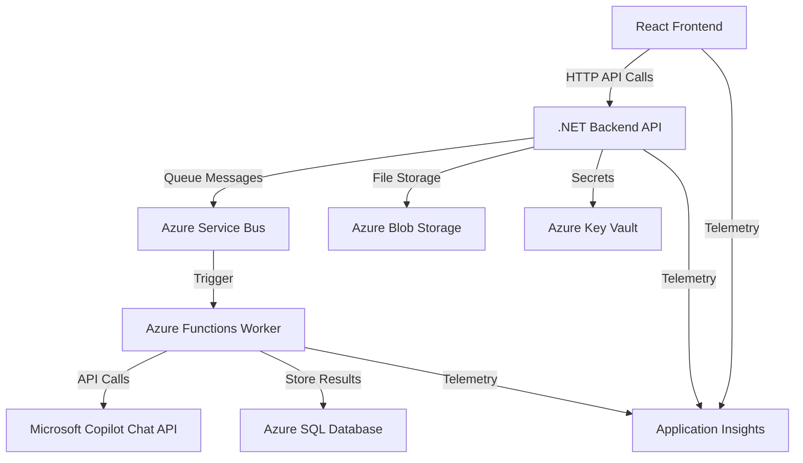

# Copilot Evaluation Tool

A React + .NET 9 Minimal API application for evaluating LLM (Large Language Model) responses against expected outputs.

## Table of Contents

- [Features](#features)
- [Project Structure](#project-structure)
- [Application Overview](#copilot-evaluation-tool---application-overview)
  - [📋 Application Purpose](#-application-purpose)
  - [🏗️ Architecture Overview](#️-architecture-overview)
    - [Frontend (React TypeScript)](#frontend-react-typescript)
    - [Backend (.NET 8 Minimal API)](#backend-net-8-minimal-api)
  - [🔧 Key Features](#-key-features)
    - [Data Management](#data-management)
    - [Evaluation Engine](#evaluation-engine)
    - [User Experience](#user-experience)
  - [☁️ Azure Services Integration](#️-azure-services-integration)
    - [Core Azure Services](#core-azure-services)
    - [Monitoring & Observability](#monitoring--observability)
  - [🔄 Data Flow Architecture](#-data-flow-architecture)
  - [🚀 Deployment Architecture](#-deployment-architecture)
  - [📊 Monitoring & Analytics](#-monitoring--analytics)
  - [🔐 Security Features](#-security-features)
  - [📈 Scalability & Performance](#-scalability--performance)
- [Getting Started](#getting-started)
  - [Prerequisites](#prerequisites)
  - [Local Development Setup](#local-development-setup)
  - [Configuration](#configuration)
  - [Development Workflow](#development-workflow)
- [Documentation](#documentation)
- [API Endpoints](#api-endpoints)
- [Usage](#usage)
- [Development](#development)
- [TODO](#todo)
- [Contributing](#contributing)

## Features

- **CSV File Upload**: Upload validation data with prompts and expected outputs
- **Dynamic Table Management**: Add, edit, and remove validation entries
- **Copilot Integration**: Get responses from Copilot Chat API
- **Similarity Scoring**: Compare expected vs actual outputs with scoring
- **Real-time Status Tracking**: Track validation progress and results

## Project Structure

```
copilotEval/
├── backend/                 # .NET 9 Minimal API
│   ├── Program.cs          # API endpoints and configuration
│   ├── Properties/         # Launch settings
│   └── CopilotEvalApi.csproj
├── frontend/               # React TypeScript application
│   ├── src/
│   │   ├── components/     # React components
│   │   ├── services/       # API service layer
│   │   ├── types/          # TypeScript interfaces
│   │   └── App.tsx         # Main application component
│   ├── package.json
│   └── vite.config.ts
└── README.md
```

# Copilot Evaluation Tool - Application Overview

## 📋 Application Purpose

The **Copilot Evaluation Tool** is a React + .NET 9 Minimal API application designed to evaluate Large Language Model (LLM) responses against expected outputs. It provides a comprehensive platform for uploading validation data, processing prompts through Microsoft Copilot Chat API, and scoring the similarity between expected and actual responses.

## 🏗️ Architecture Overview

### Frontend (React TypeScript)
- **Framework**: React 18 with TypeScript
- **Build Tool**: Vite (fast development and building)
- **UI Library**: Bootstrap 5 with React Bootstrap components
- **Key Libraries**:
  - `axios` - HTTP client for API communication
  - `papaparse` - CSV file parsing
  - `@microsoft/applicationinsights-web` - Telemetry and monitoring
  - `bootstrap-icons` - Icon library

**Capabilities**:
- CSV file upload and parsing for validation data
- Dynamic validation table management (add, edit, remove entries)
- Real-time job status tracking and progress visualization
- Similarity scoring results display
- User authentication integration

### Backend (.NET 8 Minimal API)
- **Framework**: .NET 8 with minimal API pattern
- **Database**: Entity Framework Core with SQL Server (LocalDB for development)
- **Authentication**: Azure AD JWT Bearer authentication
- **Key Dependencies**:
  - `Microsoft.Graph` - Microsoft Graph API integration
  - `Azure.Storage.Blobs` - Blob storage for file handling
  - `Azure.Messaging.ServiceBus` - Asynchronous job processing
  - `Azure.Identity` - Managed identity and credential management
  - `OpenTelemetry` - Distributed tracing and monitoring

**Core Services**:
- **Job Processing**: Asynchronous evaluation job management
- **Copilot Integration**: Microsoft Copilot Chat API communication
- **Similarity Scoring**: Levenshtein distance-based text comparison
- **Authentication**: OAuth2/OIDC with Azure AD
- **File Management**: CSV upload and processing

## 🔧 Key Features

### Data Management
- **CSV Upload**: Process validation data with "Prompt" and "Expected Output" columns
- **Manual Entry**: Add individual validation entries through UI
- **Batch Processing**: Handle multiple evaluation requests simultaneously

### Evaluation Engine
- **Copilot Integration**: Submit prompts to Microsoft Copilot Chat API
- **Similarity Scoring**: Calculate similarity between expected and actual outputs
- **Status Tracking**: Real-time progress monitoring for evaluation jobs
- **Results Export**: Export evaluation results and metrics

### User Experience
- **Authentication**: Secure login via Azure AD
- **Real-time Updates**: Live status updates during processing
- **Responsive Design**: Bootstrap-based responsive interface
- **Error Handling**: Comprehensive error states and user feedback

## ☁️ Azure Services Integration

### Core Azure Services

#### **Azure AD (Entra ID)**
- **Purpose**: User authentication and authorization
- **Implementation**: JWT Bearer token authentication
- **Scopes**: Microsoft Graph API access for Copilot integration
- **Features**: Multi-tenant support, managed identity in production

#### **Azure Service Bus**
- **Purpose**: Asynchronous job queue management
- **Queues**: Job processing pipeline for evaluation requests
- **Features**: Message correlation, dead letter queues, scaling

#### **Azure Blob Storage**
- **Purpose**: File storage for uploads and job data
- **Containers**: CSV files, job payloads, result exports
- **Features**: Secure access via managed identity

#### **Azure SQL Database**
- **Purpose**: Persistent storage for job tracking and results
- **Features**: Entity Framework integration, connection pooling
- **Fallback**: In-memory database for development

#### **Azure Key Vault**
- **Purpose**: Secure storage of secrets and connection strings
- **Secrets**: API keys, connection strings, certificates
- **Access**: Managed identity integration in production

#### **Azure Functions (Worker)**
- **Purpose**: Serverless job processing
- **Triggers**: Service Bus queue messages
- **Processing**: Copilot API calls, similarity calculations

### Monitoring & Observability

#### **Application Insights**
- **Frontend Telemetry**: User interactions, performance metrics
- **Backend Telemetry**: API call tracing, error tracking
- **Custom Metrics**: Job processing duration, success rates

#### **OpenTelemetry**
- **Distributed Tracing**: End-to-end request correlation
- **Metrics Collection**: Custom job processing metrics
- **Integration**: ASP.NET Core, Entity Framework, HTTP client instrumentation

#### **Log Analytics**
- **Centralized Logging**: Application and infrastructure logs
- **KQL Queries**: Custom dashboards and alerting
- **Monitoring**: Performance insights and error analysis

## 🔄 Data Flow Architecture



## 🚀 Deployment Architecture

### Development Environment
- **Database**: LocalDB/In-Memory
- **Authentication**: Optional (can be disabled)
- **Services**: Local development servers
- **CORS**: Configured for localhost:3000

### Production Environment
- **Hosting**: Azure App Service / Container Apps
- **Identity**: Managed Identity for Azure resource access
- **Scaling**: Auto-scaling based on queue length and CPU
- **Security**: HTTPS, Azure AD authentication, Key Vault integration

## 📊 Monitoring & Analytics

### Key Performance Indicators
- **Job Processing Metrics**: Success rate, processing duration, queue depth
- **API Performance**: Response times, error rates, throughput
- **User Analytics**: Session duration, feature usage, conversion rates
- **System Health**: Resource utilization, dependency availability

### Alerting
- **Error Rate Alerts**: API failures, job processing errors
- **Performance Alerts**: High response times, queue backlogs
- **Availability Alerts**: Service downtime, dependency failures

## 🔐 Security Features

### Authentication & Authorization
- **Azure AD Integration**: Enterprise-grade authentication
- **JWT Tokens**: Secure API access with bearer tokens
- **Managed Identity**: Passwordless Azure resource access
- **CORS Configuration**: Controlled cross-origin access

### Data Protection
- **Encryption**: Data at rest and in transit
- **Key Vault**: Secure secret management
- **Network Security**: Private endpoints, network isolation
- **Audit Logging**: Comprehensive security event tracking

## 📈 Scalability & Performance

### Frontend Optimization
- **Vite Build System**: Fast development and optimized production builds
- **Code Splitting**: Lazy loading for reduced initial bundle size
- **CDN Delivery**: Static asset optimization

### Backend Scalability
- **Minimal API**: Lightweight, high-performance API endpoints
- **Async Processing**: Non-blocking operations with Service Bus
- **Connection Pooling**: Optimized database connections
- **Caching**: Response caching where appropriate

### Infrastructure Scaling
- **Auto-scaling**: Dynamic scaling based on demand
- **Load Balancing**: Request distribution across instances
- **Queue Management**: Backpressure handling and dead letter queues

This application provides a robust, scalable platform for evaluating LLM responses with comprehensive Azure integration, modern development practices, and enterprise-grade security and monitoring capabilities.


## Getting Started

### Prerequisites

- .NET 9 SDK
- Node.js 18+ and npm
- VS Code (recommended)
- Azure CLI (for infrastructure deployment)
- Docker (optional, for containerized development)

### Local Development Setup

#### 1. Clone and Setup Repository

```bash
# Clone the repository
git clone https://github.com/boddev/copilotEval.git
cd copilotEval

# Build the entire solution to verify setup
dotnet build
```

#### 2. Backend API Setup

```bash
# Navigate to backend directory
cd backend

# Restore NuGet packages
dotnet restore

# Copy configuration template
cp appsettings.json.template appsettings.Development.json

# Configure development settings (see Configuration section below)
# Edit appsettings.Development.json with your settings

# Run the API with hot reload
dotnet watch run

# Alternative: Run without hot reload
dotnet run --urls "http://localhost:5000"
```

The API will be available at `http://localhost:5000` with Swagger UI at `/swagger`

#### 3. Frontend Setup

```bash
# Navigate to frontend directory (from repository root)
cd frontend

# Install Node.js dependencies
npm install

# Start development server with hot reload
npm run dev

# Alternative: Build for production testing
npm run build
npm run preview
```

The React app will be available at `http://localhost:3000` (Vite dev server)

#### 4. Worker Function Setup (Optional)

For local job processing testing:

```bash
# Navigate to worker directory
cd worker

# Install Azure Functions Core Tools if not already installed
npm install -g azure-functions-core-tools@4 --unsafe-perm true

# Start the worker function locally
func start --port 7071
```

The worker functions will be available at `http://localhost:7071`

### Configuration

#### Backend Configuration (appsettings.Development.json)

```json
{
  "Logging": {
    "LogLevel": {
      "Default": "Information",
      "Microsoft.AspNetCore": "Warning"
    }
  },
  "ConnectionStrings": {
    "DefaultConnection": "Server=(localdb)\\mssqllocaldb;Database=CopilotEvalDb;Trusted_Connection=true;MultipleActiveResultSets=true",
    "ServiceBus": "Endpoint=sb://your-servicebus.servicebus.windows.net/;SharedAccessKeyName=RootManageSharedAccessKey;SharedAccessKey=your-key",
    "BlobStorage": "DefaultEndpointsProtocol=https;AccountName=yourstorageaccount;AccountKey=your-key;EndpointSuffix=core.windows.net"
  },
  "AzureAd": {
    "Instance": "https://login.microsoftonline.com/",
    "TenantId": "your-tenant-id",
    "ClientId": "your-client-id",
    "ClientSecret": "your-client-secret"
  },
  "Cors": {
    "AllowedOrigins": ["http://localhost:3000", "http://localhost:5173"]
  },
  "Features": {
    "EnableAuthentication": false,
    "EnableServiceBus": false,
    "UseInMemoryDatabase": true
  }
}
```

#### Environment Variables (Alternative Configuration)

Create a `.env` file in the backend directory:

```bash
# Database
DATABASE_CONNECTION_STRING="Server=(localdb)\\mssqllocaldb;Database=CopilotEvalDb;Trusted_Connection=true"

# Azure Services (optional for local development)
AZURE_TENANT_ID="your-tenant-id"
AZURE_CLIENT_ID="your-client-id"
AZURE_CLIENT_SECRET="your-client-secret"
SERVICE_BUS_CONNECTION_STRING="your-service-bus-connection"
BLOB_STORAGE_CONNECTION_STRING="your-blob-storage-connection"

# Development Features
USE_IN_MEMORY_DATABASE=true
ENABLE_AUTHENTICATION=false
ENABLE_SERVICE_BUS=false
```

### Development Workflow

#### 1. Start All Services

Use the provided startup script:

```bash
# Make startup script executable
chmod +x scripts/start-dev.sh

# Start all services
./scripts/start-dev.sh
```

Or start services individually in separate terminals:

```bash
# Terminal 1: Backend API
cd backend && dotnet watch run

# Terminal 2: Frontend
cd frontend && npm run dev

# Terminal 3: Worker (optional)
cd worker && func start
```

#### 2. Verify Setup

Check that all services are running:

```bash
# Check API health
curl http://localhost:5000/api/health

# Check frontend (open in browser)
open http://localhost:3000

# Check worker (if running)
curl http://localhost:7071/api/health
```

#### 3. Run Tests

```bash
# Backend tests
cd backend && dotnet test

# Frontend tests
cd frontend && npm test

# Integration tests
cd backend && dotnet test --filter Category=Integration
```

### Development Tools and Utilities

#### API Testing

- **Swagger UI**: Available at `http://localhost:5000/swagger`
- **Postman Collection**: Import `docs/postman-collection.json`
- **HTTP Files**: Use `backend/CopilotEvalApi.http` with VS Code REST Client

#### Database Management

```bash
# View database (if using LocalDB)
sqllocaldb info mssqllocaldb

# Reset in-memory database (restart API)
cd backend && dotnet run

# Apply Entity Framework migrations (production)
cd backend && dotnet ef database update
```

#### Debugging

- **VS Code**: F5 to start debugging (launch configurations included)
- **Visual Studio**: Open `copilotEval.sln` and press F5
- **Browser DevTools**: React DevTools extension recommended

#### Log Monitoring

```bash
# View API logs in real-time
cd backend && dotnet run --verbosity normal

# View structured logs (if configured)
tail -f logs/copiloteval-*.log
```

### Troubleshooting

#### Common Issues

1. **Port conflicts**: Change ports in `launchSettings.json` and Vite config
2. **CORS errors**: Verify frontend URL in backend CORS configuration
3. **Database connection**: Ensure LocalDB is installed and running
4. **Package restore failures**: Clear NuGet cache with `dotnet nuget locals all --clear`

#### Reset Development Environment

```bash
# Clean all build artifacts
dotnet clean
cd frontend && npm run clean

# Reset Node modules
cd frontend && rm -rf node_modules && npm install

# Reset database (if using LocalDB)
sqllocaldb stop mssqllocaldb
sqllocaldb start mssqllocaldb
```

## Documentation

### Architecture & Operations
- **[Architecture Documentation](docs/architecture.md)** - System design, components, and technology decisions
- **[Operational Runbook](docs/runbook.md)** - Troubleshooting, monitoring, and recovery procedures
- **[API Collection](docs/postman-collection.json)** - Postman collection for API testing and onboarding

### Infrastructure
- **[Infrastructure Guide](infra/README.md)** - Azure deployment and infrastructure management
- **[Deployment Summary](infra/DEPLOYMENT_SUMMARY.md)** - Infrastructure setup overview

## API Endpoints

### Core Endpoints
- `GET /api/health` - Health check endpoint
- `POST /api/jobs` - Submit evaluation job for processing
- `GET /api/jobs/{id}` - Get job status and results
- `GET /api/jobs` - List jobs with pagination

### Authentication
- `GET /api/auth/url` - Get OAuth authorization URL
- `POST /api/auth/token` - Exchange code for access token

### Copilot Integration  
- `GET /api/copilot/agents` - List available Copilot agents
- `GET /api/copilot/knowledge-sources` - List knowledge sources
- `POST /api/copilot/chat` - Get response from Copilot Chat API

### Evaluation
- `POST /api/similarity/score` - Calculate similarity score between texts

### Development
- `POST /api/debug/json` - Debug JSON serialization for Copilot requests

For complete API documentation, import the [Postman Collection](docs/postman-collection.json) or view the Swagger UI at `/swagger` when running locally.

## Usage

1. **Upload CSV File**: Use the file upload component to load validation data
   - Expected CSV format: columns named "Prompt" and "Expected Output"
   
2. **Add Entries Manually**: Use the "Add Entry" button to create new validation entries

3. **Process Entries**: The system will automatically process entries through the Copilot API and calculate similarity scores

4. **View Results**: Results are displayed in the validation table with scores and status

## Development

### Frontend Development

- Uses Vite for fast development and building
- TypeScript for type safety
- PapaParse for CSV parsing
- Axios for HTTP requests

### Backend Development

- .NET 9 Minimal API pattern
- CORS enabled for React development
- Simple similarity scoring using Levenshtein distance
- Ready for Copilot Chat API integration

## TODO

- [ ] Implement actual Copilot Chat API integration
- [ ] Add authentication and authorization
- [ ] Implement data persistence
- [ ] Add batch processing capabilities
- [ ] Add export functionality for results
- [ ] Improve similarity scoring algorithms

## Contributing

This project is set up for easy development in VS Code with proper TypeScript configuration and .NET tooling.
