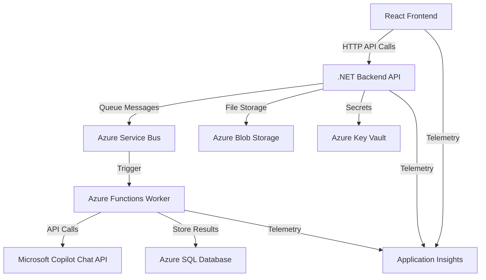

# Copilot Evaluation Tool - Application Overview

## 📋 Application Purpose

The **Copilot Evaluation Tool** is a React + .NET 9 Minimal API application designed to evaluate Large Language Model (LLM) responses against expected outputs. It provides a comprehensive platform for uploading validation data, processing prompts through Microsoft Copilot Chat API, and scoring the similarity between expected and actual responses.

## 🏗️ Architecture Overview

### Frontend (React TypeScript)
- **Framework**: React 18 with TypeScript
- **Build Tool**: Vite (fast development and building)
- **UI Library**: Bootstrap 5 with React Bootstrap components
- **Key Libraries**:
  - `axios` - HTTP client for API communication
  - `papaparse` - CSV file parsing
  - `@microsoft/applicationinsights-web` - Telemetry and monitoring
  - `bootstrap-icons` - Icon library

**Capabilities**:
- CSV file upload and parsing for validation data
- Dynamic validation table management (add, edit, remove entries)
- Real-time job status tracking and progress visualization
- Similarity scoring results display
- User authentication integration

### Backend (.NET 8 Minimal API)
- **Framework**: .NET 8 with minimal API pattern
- **Database**: Entity Framework Core with SQL Server (LocalDB for development)
- **Authentication**: Azure AD JWT Bearer authentication
- **Key Dependencies**:
  - `Microsoft.Graph` - Microsoft Graph API integration
  - `Azure.Storage.Blobs` - Blob storage for file handling
  - `Azure.Messaging.ServiceBus` - Asynchronous job processing
  - `Azure.Identity` - Managed identity and credential management
  - `OpenTelemetry` - Distributed tracing and monitoring

**Core Services**:
- **Job Processing**: Asynchronous evaluation job management
- **Copilot Integration**: Microsoft Copilot Chat API communication
- **Similarity Scoring**: Levenshtein distance-based text comparison
- **Authentication**: OAuth2/OIDC with Azure AD
- **File Management**: CSV upload and processing

## 🔧 Key Features

### Data Management
- **CSV Upload**: Process validation data with "Prompt" and "Expected Output" columns
- **Manual Entry**: Add individual validation entries through UI
- **Batch Processing**: Handle multiple evaluation requests simultaneously

### Evaluation Engine
- **Copilot Integration**: Submit prompts to Microsoft Copilot Chat API
- **Similarity Scoring**: Calculate similarity between expected and actual outputs
- **Status Tracking**: Real-time progress monitoring for evaluation jobs
- **Results Export**: Export evaluation results and metrics

### User Experience
- **Authentication**: Secure login via Azure AD
- **Real-time Updates**: Live status updates during processing
- **Responsive Design**: Bootstrap-based responsive interface
- **Error Handling**: Comprehensive error states and user feedback

## ☁️ Azure Services Integration

### Core Azure Services

#### **Azure AD (Entra ID)**
- **Purpose**: User authentication and authorization
- **Implementation**: JWT Bearer token authentication
- **Scopes**: Microsoft Graph API access for Copilot integration
- **Features**: Multi-tenant support, managed identity in production

#### **Azure Service Bus**
- **Purpose**: Asynchronous job queue management
- **Queues**: Job processing pipeline for evaluation requests
- **Features**: Message correlation, dead letter queues, scaling

#### **Azure Blob Storage**
- **Purpose**: File storage for uploads and job data
- **Containers**: CSV files, job payloads, result exports
- **Features**: Secure access via managed identity

#### **Azure SQL Database**
- **Purpose**: Persistent storage for job tracking and results
- **Features**: Entity Framework integration, connection pooling
- **Fallback**: In-memory database for development

#### **Azure Key Vault**
- **Purpose**: Secure storage of secrets and connection strings
- **Secrets**: API keys, connection strings, certificates
- **Access**: Managed identity integration in production

#### **Azure Functions (Worker)**
- **Purpose**: Serverless job processing
- **Triggers**: Service Bus queue messages
- **Processing**: Copilot API calls, similarity calculations

### Monitoring & Observability

#### **Application Insights**
- **Frontend Telemetry**: User interactions, performance metrics
- **Backend Telemetry**: API call tracing, error tracking
- **Custom Metrics**: Job processing duration, success rates

#### **OpenTelemetry**
- **Distributed Tracing**: End-to-end request correlation
- **Metrics Collection**: Custom job processing metrics
- **Integration**: ASP.NET Core, Entity Framework, HTTP client instrumentation

#### **Log Analytics**
- **Centralized Logging**: Application and infrastructure logs
- **KQL Queries**: Custom dashboards and alerting
- **Monitoring**: Performance insights and error analysis

## 🔄 Data Flow Architecture

## 🚀 Deployment Architecture

### Development Environment
- **Database**: LocalDB/In-Memory
- **Authentication**: Optional (can be disabled)
- **Services**: Local development servers
- **CORS**: Configured for localhost:3000

### Production Environment
- **Hosting**: Azure App Service / Container Apps
- **Identity**: Managed Identity for Azure resource access
- **Scaling**: Auto-scaling based on queue length and CPU
- **Security**: HTTPS, Azure AD authentication, Key Vault integration

## 📊 Monitoring & Analytics

### Key Performance Indicators
- **Job Processing Metrics**: Success rate, processing duration, queue depth
- **API Performance**: Response times, error rates, throughput
- **User Analytics**: Session duration, feature usage, conversion rates
- **System Health**: Resource utilization, dependency availability

### Alerting
- **Error Rate Alerts**: API failures, job processing errors
- **Performance Alerts**: High response times, queue backlogs
- **Availability Alerts**: Service downtime, dependency failures

## 🔐 Security Features

### Authentication & Authorization
- **Azure AD Integration**: Enterprise-grade authentication
- **JWT Tokens**: Secure API access with bearer tokens
- **Managed Identity**: Passwordless Azure resource access
- **CORS Configuration**: Controlled cross-origin access

### Data Protection
- **Encryption**: Data at rest and in transit
- **Key Vault**: Secure secret management
- **Network Security**: Private endpoints, network isolation
- **Audit Logging**: Comprehensive security event tracking

## 📈 Scalability & Performance

### Frontend Optimization
- **Vite Build System**: Fast development and optimized production builds
- **Code Splitting**: Lazy loading for reduced initial bundle size
- **CDN Delivery**: Static asset optimization

### Backend Scalability
- **Minimal API**: Lightweight, high-performance API endpoints
- **Async Processing**: Non-blocking operations with Service Bus
- **Connection Pooling**: Optimized database connections
- **Caching**: Response caching where appropriate

### Infrastructure Scaling
- **Auto-scaling**: Dynamic scaling based on demand
- **Load Balancing**: Request distribution across instances
- **Queue Management**: Backpressure handling and dead letter queues

This application provides a robust, scalable platform for evaluating LLM responses with comprehensive Azure integration, modern development practices, and enterprise-grade security and monitoring capabilities.